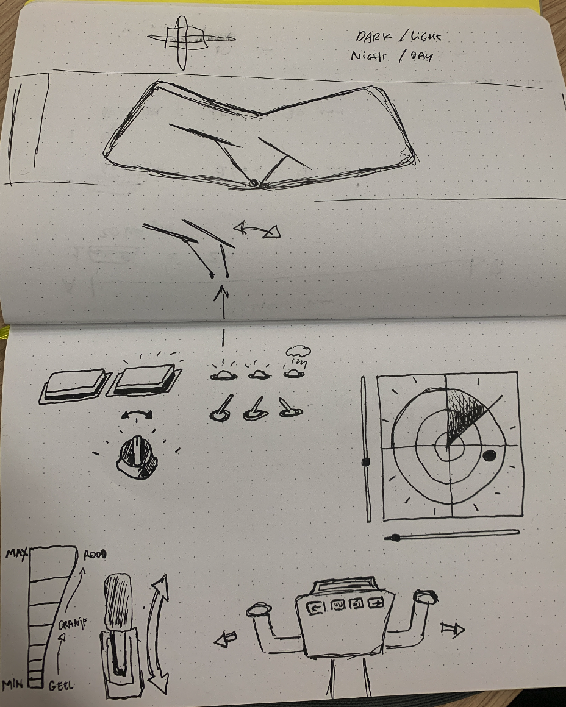
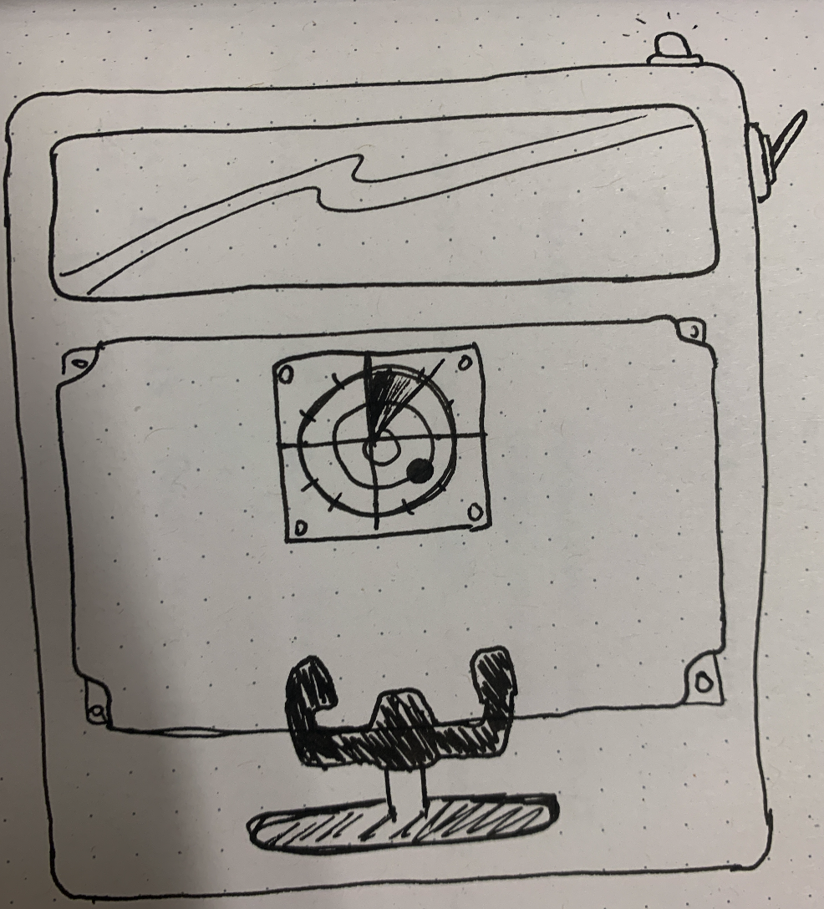
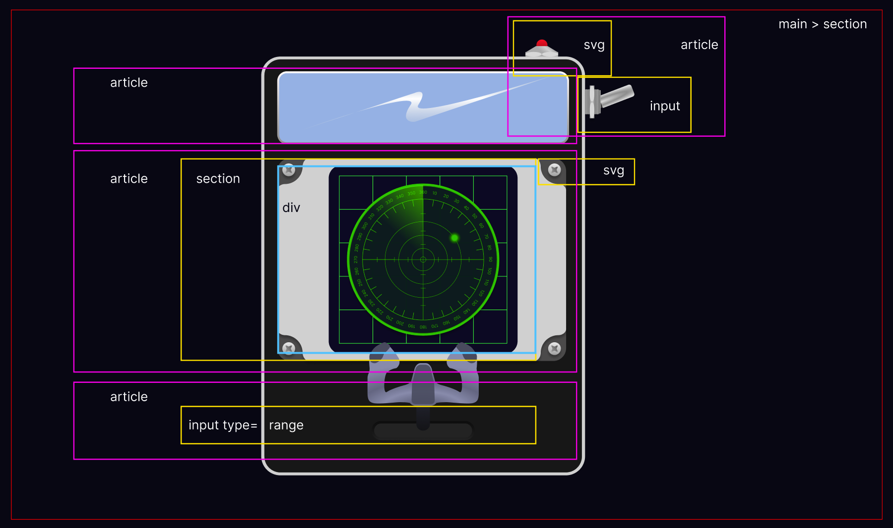
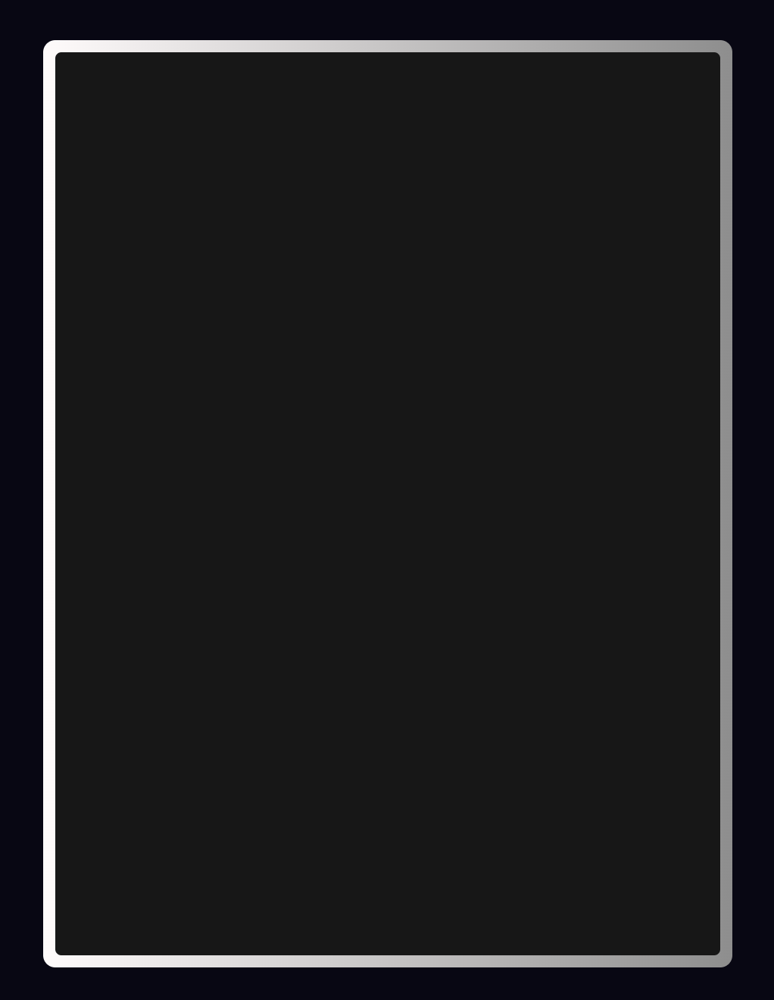
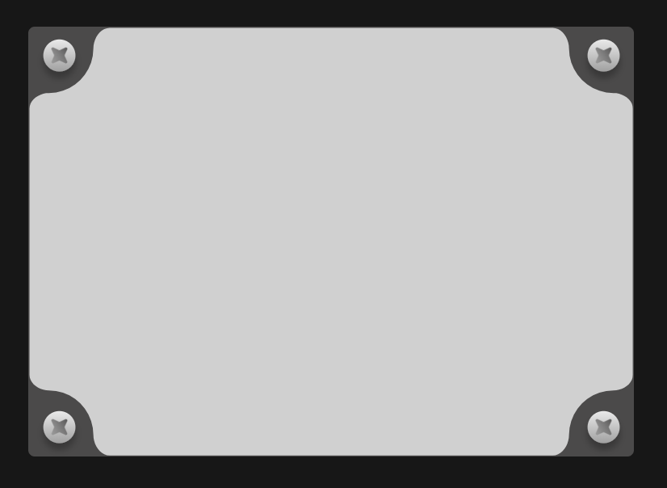
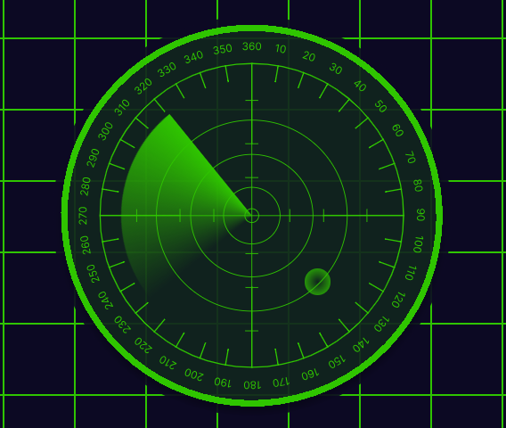
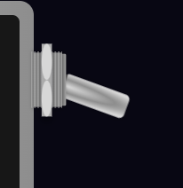

# Process Report

In this readme you will read the process of my assessment.

## The Plan

The assignment I chose is to create a control panel. Since I love airplanes my initial idea was to recreate a cockpit. I like to give things a little twist so I came up with a pocket sized cockpit.
I want to use container queries to add panels when the size of the screen is bigger. I will also make use nesting to make my code more clean and readable.

- When steering I want the user to see that the direction changes through the window.
- I want a switch that turns on dark light mode
- I also want a switch to turn on the window wipers
- The first panel will be a radar with a animation

### Sketches

This are the sketches of my ideas. The first one is the main cockpit idea. I took the elements of the first idea and put them into a pocket sized box.




### Design

For the design I wanted it to be clean and clear for the user. Not to many distractions. I looked up multiple references


### Breakdown

To get started I made a breakdown for the elements. This helped me define the structure of the page. I made the box a section container en every element on the box is an article. If there are multiple elements in another element I use sections to separate them. For the inputs I will use svg's to style them.



### Techniques

The main techniques that I will be using are animations, background images, gradients, inputs (checkbox and range) and clip-paths. I will need the :has selector and I will need to make use of :before and :after elements. Some challenges may lay with responsiveness and container queries. Also the :has selector is completely new for me so that will probably take some more time.

## Process Week 2

### The Box

The first thing I made is the box of the control panel. I found out you can not put a gradient on a border, but I wanted to make the border a bit shiny. I fixed this by layering one square on top of another and make the first one a little bigger than the other one. Then I have the one in the back a gradient.



```css
main{
    background: linear-gradient(90deg, #FFFCFC, #9F9F9F);
    border-radius: .5em;
    padding: .5em;
}

main > section{
    position: relative;
    height: 80vh;
    width: 60vw;
    display: flex;
    flex-direction: column;
    justify-content: space-between;
    gap: 1em;
    border-radius: .25em;
    background-color: var(--box-color);
    padding: 2em;
}
```

### The Window

I had the same problem with the window so I made this the same way. I used the element for the gradient, the :before element for the background image and the :after element for the reflection.


```css
/* the window */
article:first-of-type{
    height: 100px;
    width: 100%;
    background: linear-gradient(90deg, #FFFCFC, #9F9F9F);
    border-radius: .25em;
    position: relative;
}

article:first-of-type::before{
    content: '';
    position: absolute;
    top: 5px;
    left: 5px;
    right: 5px;
    bottom: 5px;
    background-image: url(../assets/clouds.jpeg);
    background-size: 200%;
    background-repeat: no-repeat;
    background-position: calc(1% * var(--direction));
    border-radius: .25em;
    z-index: 1;
}

article:first-of-type::after{
    content: '';
    position: absolute;
    top: 5px;
    left: 5px;
    right: 5px;
    bottom: 5px;
    background-image: url(../assets/reflection.svg);
    background-size: contain;
    background-repeat: no-repeat;
    background-position: 0;
    z-index: 2;
}
```

### Radar Plate

The next element was a bit of a challenge. I knew the clip-path technique but had not used it al lot before. I wanted it to have round edges but also stay responsive. After a but of struggling I found a website that could generate a clip-path from a svg. I just had to modify the values to percentages to make it responsive. As you can see this is a very long piece of code to modify.

```css
article:nth-of-type(2) > section::before{
    content: "";
    position: absolute;
    left: 50%;
    top: 50%;
    transform: translate(-50%, -50%);

    width: 100%;
    height: 100%;

    clip-path: polygon(12.8653px 41.0629px, 12.8653px 41.0629px, 17.3351261px 40.7022309px, 21.5753208px 39.6580472px, 25.5291487px 37.9870843px, 29.1398744px 35.7460776px, 32.3507625px 32.9917625px, 35.1050776px 29.7808744px, 37.3460843px 26.1701487px, 39.0170472px 22.2163208px, 40.0612309px 17.9761261px, 40.4219px 13.5063px, 40.4219px 13.5063px, 40.4219px 13.5063px, 40.5427016px 11.685959098px, 40.8964088px 9.868913264px, 41.4699752px 8.099518806px, 42.2503544px 6.422132032px, 43.2245px 4.88110925px, 44.3793656px 3.520806768px, 45.7019048px 2.385580894px, 47.1790712px 1.519787936px, 48.7978184px 0.967784202px, 50.5451px 0.773926px, calc(100% - 50.389px) 0.773926px, calc(100% - 50.389px) 0.773926px, calc(100% - 48.641724px) 0.967784472px, calc(100% - 47.022992px) 1.519788896px, calc(100% - 45.545848px) 2.385582784px, calc(100% - 44.223336px) 3.520809648px, calc(100% - 43.0685px) 4.881113px, calc(100% - 42.094384px) 6.422136352px, calc(100% - 41.314032px) 8.099523216px, calc(100% - 40.740488px) 9.868917104px, calc(100% - 40.386796px) 11.685961528px, calc(100% - 40.266px) 13.5063px, calc(100% - 40.266px) 13.5063px, calc(100% - 40.266px) 13.5063px, calc(100% - 39.905345px) 17.9761261px, calc(100% - 38.8612px) 22.2163208px, calc(100% - 37.190295px) 26.1701487px, calc(100% - 34.94936px) 29.7808744px, calc(100% - 32.195125px) 32.9917625px, calc(100% - 28.98432px) 35.7460776px, calc(100% - 25.373675px) 37.9870843px, calc(100% - 21.41992px) 39.6580472px, calc(100% - 17.179785px) 40.7022309px, calc(100% - 12.71px) 41.0629px, calc(100% - 12.71px) 41.0629px, calc(100% - 12.71px) 41.0629px, calc(100% - 10.979918px) 41.1786302px, calc(100% - 9.2595439999998px) 41.5173456px, calc(100% - 7.589486px) 42.0663334px, calc(100% - 6.010352px) 42.8128808px, calc(100% - 4.56275px) 43.744275px, calc(100% - 3.2872879999999px) 44.8478032px, calc(100% - 2.224574px) 46.1107526px, calc(100% - 1.415216px) 47.5204104px, calc(100% - 0.89982199999992px) 49.0640638px, calc(100% - 0.71899999999999px) 50.729px, calc(100% - 0.71899999999999px) calc(100% - 50.56px), calc(100% - 0.71899999999999px) calc(100% - 50.56px), calc(100% - 0.89982199999992px) calc(100% - 48.895261px), calc(100% - 1.4152159999999px) calc(100% - 47.351728px), calc(100% - 2.224574px) calc(100% - 45.942127px), calc(100% - 3.287288px) calc(100% - 44.679184px), calc(100% - 4.56275px) calc(100% - 43.575625px), calc(100% - 6.010352px) calc(100% - 42.644176px), calc(100% - 7.589486px) calc(100% - 41.897563px), calc(100% - 9.259544px) calc(100% - 41.348512px), calc(100% - 10.979918px) calc(100% - 41.009749px), calc(100% - 12.71px) calc(100% - 40.894px), calc(100% - 12.71px) calc(100% - 40.894px), calc(100% - 12.71px) calc(100% - 40.894px), calc(100% - 17.179785px) calc(100% - 40.533345px), calc(100% - 21.41992px) calc(100% - 39.4892px), calc(100% - 25.373675px) calc(100% - 37.818295px), calc(100% - 28.98432px) calc(100% - 35.57736px), calc(100% - 32.195125px) calc(100% - 32.823125px), calc(100% - 34.94936px) calc(100% - 29.61232px), calc(100% - 37.190295px) calc(100% - 26.001675px), calc(100% - 38.8612px) calc(100% - 22.04792px), calc(100% - 39.905345px) calc(100% - 17.807785px), calc(100% - 40.266px) calc(100% - 13.338px), calc(100% - 40.266px) calc(100% - 13.338px), calc(100% - 40.266px) calc(100% - 13.338px), calc(100% - 40.386796px) calc(100% - 11.517644px), calc(100% - 40.740488px) calc(100% - 9.700552px), calc(100% - 41.314032px) calc(100% - 7.931088px), calc(100% - 42.094384px) calc(100% - 6.253616px), calc(100% - 43.0685px) calc(100% - 4.7125px), calc(100% - 44.223336px) calc(100% - 3.352104px), calc(100% - 45.545848px) calc(100% - 2.2167920000001px), calc(100% - 47.022992px) calc(100% - 1.3509280000001px), calc(100% - 48.641724px) calc(100% - 0.79887600000001px), calc(100% - 50.389px) calc(100% - 0.60500000000008px), 50.5451px calc(100% - 0.60500000000002px), 50.5451px calc(100% - 0.60500000000002px), 48.7978184px calc(100% - 0.79887599999995px), 47.1790712px calc(100% - 1.350928px), 45.7019048px calc(100% - 2.2167920000001px), 44.3793656px calc(100% - 3.352104px), 43.2245px calc(100% - 4.7125px), 42.2503544px calc(100% - 6.253616px), 41.4699752px calc(100% - 7.931088px), 40.8964088px calc(100% - 9.700552px), 40.5427016px calc(100% - 11.517644px), 40.4219px calc(100% - 13.338px), 40.4219px calc(100% - 13.338px), 40.4219px calc(100% - 13.338px), 40.0612309px calc(100% - 17.807785px), 39.0170472px calc(100% - 22.04792px), 37.3460843px calc(100% - 26.001675px), 35.1050776px calc(100% - 29.61232px), 32.3507625px calc(100% - 32.823125px), 29.1398744px calc(100% - 35.57736px), 25.5291487px calc(100% - 37.818295px), 21.5753208px calc(100% - 39.4892px), 17.3351261px calc(100% - 40.533345px), 12.8653px calc(100% - 40.894px), 12.8653px calc(100% - 40.894px), 12.8653px calc(100% - 40.894px), 11.135284686px calc(100% - 41.009749px), 9.414962048px calc(100% - 41.348512px), 7.744942042px calc(100% - 41.897563px), 6.165834624px calc(100% - 42.644176px), 4.71824975px calc(100% - 43.575625px), 3.442797376px calc(100% - 44.679184px), 2.380087458px calc(100% - 45.942127px), 1.570729952px calc(100% - 47.351728px), 1.055334814px calc(100% - 48.895261px), 0.874512px calc(100% - 50.56px), 0.874512px 50.7289px, 0.874512px 50.7289px, 1.055335084px 49.0639909px, 1.570730912px 47.5203592px, 2.380089348px 46.1107183px, 3.442800256px 44.8477816px, 4.7182535px 43.7442625px, 6.165838944px 42.8128744px, 7.744946452px 42.0663307px, 9.414965888px 41.5173448px, 11.135287116px 41.1786301px, 12.8653px 41.0629px, 12.8653px 41.0629px); 
    background-color: var(--plate-color-primary); 
}
```

#### Screws

Now the plate is done I had to position the screws I made in Figma. This was pretty easy to do. I just had to position them with position: absolute and put each of them in a different corner. The plate with the screws ended up looking like this:



```css
article:nth-of-type(2) > img:first-of-type{
    position: absolute;
    top: .3em;
    left: .3em;
}

article:nth-of-type(2) > img:nth-of-type(2){
    position: absolute;
    top: .3em;
    right: .3em;
}

article:nth-of-type(2) > img:nth-of-type(3){
    position: absolute;
    bottom: 0;
    left: .3em;
}

article:nth-of-type(2) > img:last-of-type{
    position: absolute;
    bottom: 0;
    right: .3em;
}
```

### Radar

Now the radar could be placed on top of the plate. This was pretty easy as well. I placed it in the center with position: absolute and transform translate. And put the radar image as a background-image.

```css
article:nth-of-type(2) > section::after{
    content: "";
    position: absolute;
    left: 50%;
    top: 50%;
    transform: translate(-50%, -50%);

    width: 90%;
    height: 90%;

    background-image: url(../assets/radar.svg);
}
```

#### Radar Sensor

I also needed a radar sensor with an animation to make it more realistic. To do this I used a conic-gradient. I hadn't used this before so I had to take a quick look at MDN and found out it was quite easy to do. I started with making a circle and place it in the center of the radar element. Then I gave it a conic gradient from green to transparent.

```css
/* radar sensor */
article:nth-of-type(2) > section div::before{
    content: "";
    position: absolute;
    top: 50%;
    left: 50%;
    transform: translate(-50%, -50%);
    aspect-ratio: 1/1;

    min-height: 50%;
    min-width: 50%;
    border-radius: 100%;
    background: conic-gradient(rgba(255,255,255,0) 75%,  var(--radar-color) 100%);

    animation: radar 2s linear infinite;
}
```

The only thing that needed to be done was rotate the circle. If I wouldn't have added the translate function the rotation would have overwritten the position.

```css
@keyframes radar{
    0%{
        transform: translate(-50%, -50%) rotate(0deg);
    }
    100%{
        transform: translate(-50%, -50%) rotate(360deg);
    }
}
```

#### Radar Object

I thought it would be fun if the radar would also detect something when scanning the area so I added a green dot every time the sensor would go over a specific area. With position absolute and top/left I positioned the object in the bottom right area of the radar. When looking at it I noticed it was exactly at 135°. It's 3/8 of the circle so 360/8*3=135. To make it easier for myself I made the objective animation just as long as the sensor animation (2 seconds).

For the radar 360° is 100%. In 120s the sensor wil do 1 turn. 
To find out the percentage of the object we have to make the same calculation as we did in the beginning but now a ful circle is not 360° but 100%:
100/8*3 = 37,5%.

Know I know that when the sensor arrives at 37,5% it "hits" the object. I want the object to be invisible until the sensor hits it so in the animation I make sure the opacity is 1 at 37%.

I really like these small calculations.



```css
    > section div::after{
        content: "";
        position: absolute;
        top: 60%;
        left: 60%;
    
        min-height: 5%;
        min-width: 5%;
        aspect-ratio: 1/1;
        border-radius: 100%;
        background: radial-gradient(rgba(255,255,255,0) 0%,  var(--radar-color) 100%);
    
        animation: objective 2s ease-out infinite;
    }

@keyframes objective{
    0%{
        opacity: 1;
    }

    37%{
        opacity: 0;
    }

    40%{

        opacity: 1;
    }


    100%{
        opacity: 1;
    }
}
```

### Switch

I wanted to create a realistic airplane switch to toggle the window wipers. I also wanted this to have a little LED as a little extra. I knew this was going to be a challenge because of the usage of the :has selector. This was really fun to do. I divided the switch itself in to 2 pieces. The base and the toggle.
I placed the base on the label with a background image and placed this on the side of the box with position absolute. The toggle was placed on a the before element of the label so I could rotate this when the switch was toggled on. I had to use transform-origin to make sure the toggle would rotate on from the left and not the center.



```css
article:last-of-type{
    & label input{
        display: none;
    }

    /* switch base */
    & label{
        display: flex;
        justify-content: center;
        align-items: center;
    
        position: absolute;
        right: -4.3em;
        top: 1em;
        height: 3em;
        width: 4em;
    
        background-image: url(../assets/switchBolt.svg);
        background-size: contain;
        background-repeat: no-repeat;
        background-position: center left;
    
        cursor: pointer;
    }

    /* switch toggle */
    & label:before{
        content: '';
        height: 100%;
        width: 2.8em;

        position: absolute;
        top: -2px;
        left: 1em;
        z-index: -1;

        background-image: url(../assets/toggle.svg);
        background-size: contain;
        background-repeat: no-repeat;
        background-position: center left;
    
        transform-origin: left center;
        transform: rotate(20deg);
        transition: transform .3s;
    }
```

#### LED

The LED was also build into 2 pieces. The base of the LED is an svg image and I used the before element to create the LED itself and place it behind the bolt. I gave the initial color a red gradient since the switch is turned off at first.


```css
    /* led */
    > div{
        height: 2em;
        width: 2.5em;

        position: absolute;
        top: -2.4em;
        right: 1em;

        background-image:url(../assets/bolt.svg);
        background-size: contain;
        background-repeat: no-repeat;
        background-position: bottom center;
    }

    /* led off */
    > div::before{
        content: '';
        height: 1.5em;
        width: .8em;

        position: absolute;
        left: 50%;
        bottom: 0;
        z-index: -1;

        transform: translateX(-50%);
        border-radius: 1em;
        background: linear-gradient(var(--led-color, 120deg, #ff3f3f, #a62020 ));
    }
}
```

#### Window Wipers

The last thing I worked on this week were the window wipers. At first I added 1 image, duplicated and transformed the scale X to flip the image, but later on I got stuck when animating the wipers. So therefor I just added another image which already had the right angle to get rid of this problem. I made both images the same height and calculated their position from the middle individually. I gave them both another origin to make sure the rotation would be correctly.

```css
/* wipers */
    > img{
        position: absolute;
        bottom: 5px;
        left: 50%;
        z-index: 2;
        height: 75%;
    }

    > img:first-of-type{
        transform: translateX(-110%);
        transform-origin: bottom left;
        animation: wiperLeft 1s ease-in-out alternate infinite paused;
    }

    > img:last-of-type{
        transform: translateX(10%);
        transform-origin: bottom right;
        animation: wiperRight 1s ease-in-out alternate infinite paused;
    }
```

I made a little typo in the animation, where I rotated the image before translating it which fucked up the transform origin. Nils helped me figure this out. After that the animation worked perfectly.

```css
@keyframes wiperLeft{
    from{
        transform: translateX(-110%) rotate(0deg);
    }

    to{
        transform: translateX(-110%) rotate(-121deg);
    }
}

@keyframes wiperRight{
    from{
        transform:translateX(10%) rotate(0deg);
        
    }

    to{
        transform: translateX(10%) rotate(121deg);
    }
}
```

## Process Week 3

### Steering Wheel

- javascript

#### Window View

- background image

#### Radar Rotation

- rotation

### CSS Nesting

### Style Queries

## Resources

- [SVG to Clip-path ](https://www.plantcss.com/convert-svg-to-css-clip-path)
- [Conic Gradient](https://developer.mozilla.org/en-US/docs/Web/CSS/gradient/conic-gradient)
- [Range Slider](https://css-tricks.com/styling-cross-browser-compatible-range-inputs-css/)


<!-- Week 2 & 3 - Progress
- Show your progress (text, code and pictures).
- What went smoothly, and what was challenging?
- What experiments did you conduct that 'failed'?
- Do you have new insights into how to leverage the power of CSS
(or not)?
- Incorporate changes to your initial plan.
- The challenges for next week.

Week 4 - Completion
- Discuss your final result (text, code and pictures).
- What went smoothly, what was challenging, and what are you
most proud of?
- What experiments did you conduct that 'failed'?
- Do you have new insights into how to leverage the power of CSS
(or not)?
- What do you want to explore further?  -->