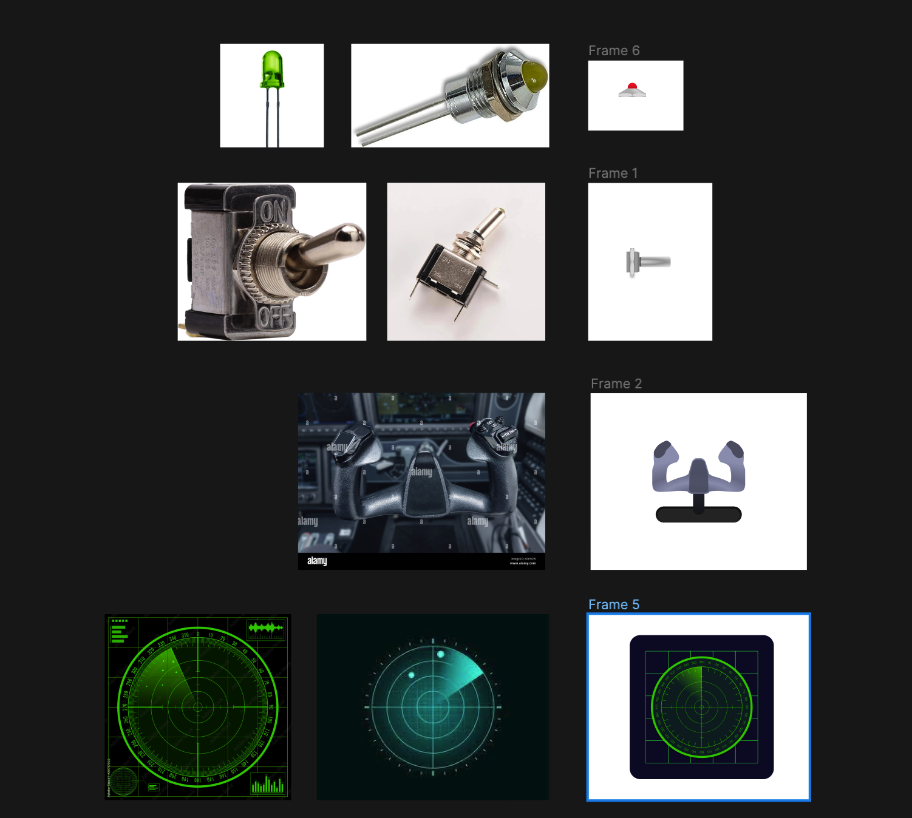
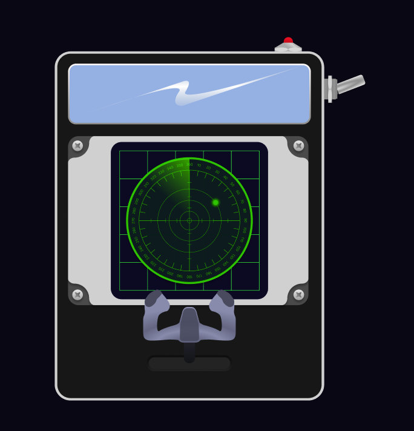

# Process Report

In this readme you will read the process of my assessment.

## The Plan

The assignment I chose is to create a control panel. Since I love airplanes my initial idea was to recreate a cockpit. I like to give things a little twist so I came up with a pocket sized cockpit.
I want to use container queries to add panels when the size of the screen is bigger.

- When steering I want the user to see that the direction changes through the window.
- I want a switch that turns on dark light mode
- I also want a switch to turn on the window wipers
- The first panel will be a radar with a animation

### Sketches

### Design

For the design I wanted it to be clean and clear for the user. Not to many distractions.

### Breakdown

### Techniques

I think the main techniques that I will use are animations, background images, gradients, inputs (checkbox and range) and clip-paths. I will need the has selector and I will need to make use of before and after elements. Some challenges may lay with responsiveness and container queries. Also the has selector is completely new for me so that will probably take some more time.

<!-- Week 1 - Your plan
- Your assignment choice, and the options you select.
- Which CSS techniques will you start with?
- Where do your (major) challenges lie?
- Include sketch(es) of your design.
- Perhaps also create an initial breakdown sketch.

Week 2 & 3 - Progress
- Show your progress (text, code and pictures).
- What went smoothly, and what was challenging?
- What experiments did you conduct that 'failed'?
- Do you have new insights into how to leverage the power of CSS
(or not)?
- Incorporate changes to your initial plan.
- The challenges for next week.

Week 4 - Completion
- Discuss your final result (text, code and pictures).
- What went smoothly, what was challenging, and what are you
most proud of?
- What experiments did you conduct that 'failed'?
- Do you have new insights into how to leverage the power of CSS
(or not)?
- What do you want to explore further? -->